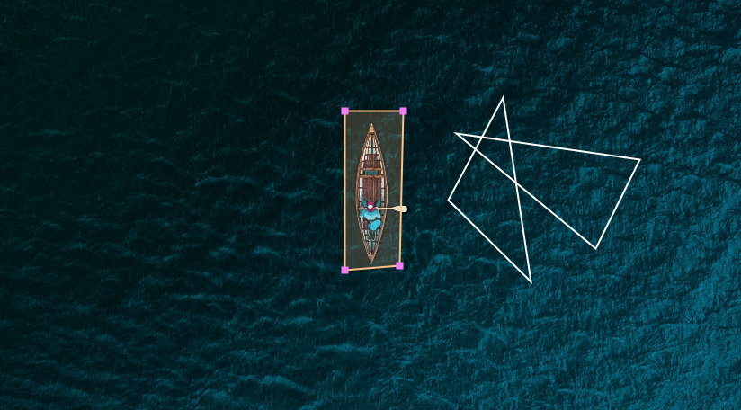

> This package is for internal use, it is not officialy stable.

# react-canvas-annotation

> A canvas annotation library for React.

[](https://www.npmjs.com/package/react-canvas-annotation) [](https://standardjs.com)



## Overview

An annotation component implemented with React.
Built on [Canvas API](https://developer.mozilla.org/en-US/docs/Web/API/Canvas_API)

- Supports **Rectangles** and **Polygons** shapes.
- Supports **zoom**, **dragging** and more.

Check out the [Demo Page](https://denvash.github.io/react-canvas-annotation/) and [example](example/src/App.js) code.

## Install

```bash
yarn add react-canvas-annotation
```

## Usage

```js
import ReactCanvasAnnotation from 'react-canvas-annotation';

<ReactCanvasAnnotation
  zoom={zoom}
  imageFile={imageFile}
  labels={labels}
  onChange={setLabels}
  annotationType={annotationType}
  isImageDrag={isImageDrag}
  onMouseOut={onMouseOut}
  onHover={onHover}
  onClick={onClick}
/>;
```

## License

MIT © [denvash](https://github.com/denvash)
